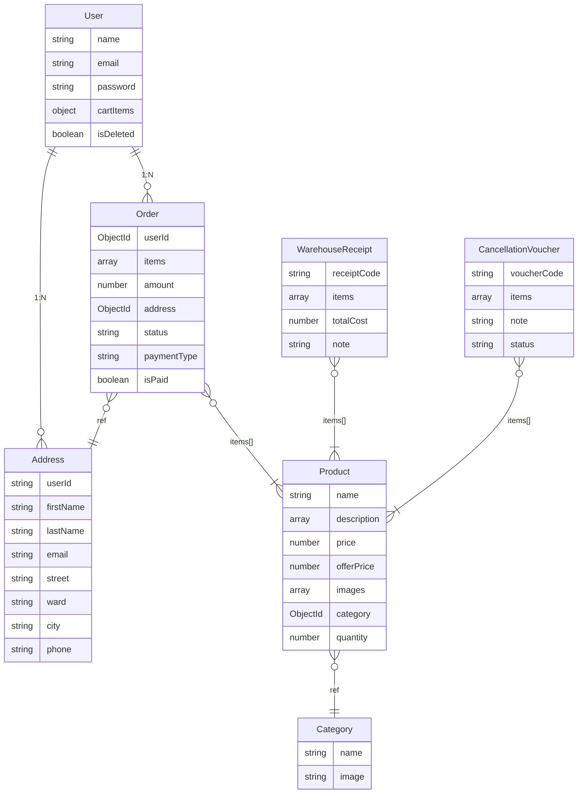
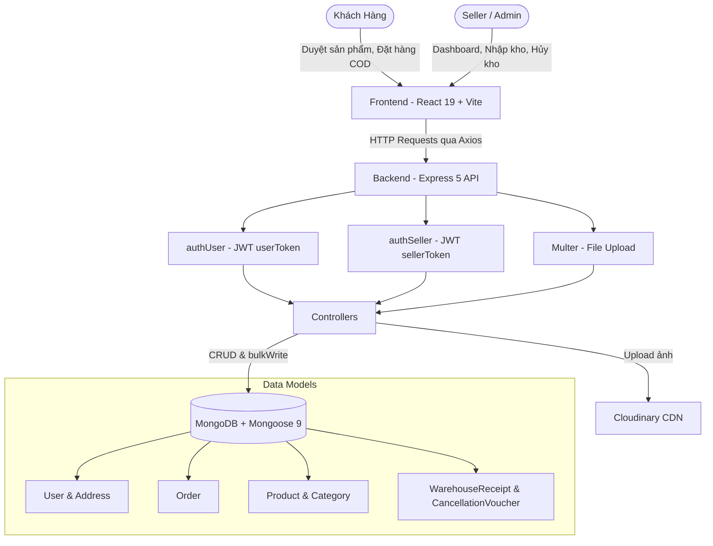

# 🛒 GreenCart


## **Nền tảng thương mại điện tử fullstack hiện đại, xây dựng trên MERN Stack**

## 📋 Mục lục

- [Giới thiệu dự án](#-giới-thiệu-dự-án)
- [Tính năng nổi bật](#-tính-năng-nổi-bật)
- [Công nghệ sử dụng](#-công-nghệ-sử-dụng)
- [Kiến trúc CSDL & Luồng hoạt động](#-kiến-trúc-csdl--luồng-hoạt-động)
- [API Endpoints](#-api-endpoints)
- [Hướng dẫn cài đặt](#-hướng-dẫn-cài-đặt)
- [Biến môi trường](#-biến-môi-trường)
- [Hướng dẫn sử dụng](#-hướng-dẫn-sử-dụng)
- [Cấu trúc thư mục](#-cấu-trúc-thư-mục)

---

## 📖 Giới thiệu dự án

**GreenCart** là ứng dụng thương mại điện tử fullstack với giao diện hiện đại, được xây dựng trên hạ tầng **MERN** (MongoDB, Express, React, Node.js). Hệ thống được thiết kế theo kiến trúc tách biệt Client–Server, tối ưu hai luồng chính: **trải nghiệm mua sắm** cho khách hàng và **quản lý vận hành kho hàng** cho Seller/Admin.

| Ứng dụng  | Vai trò | Cổng mặc định |
| --------- | ------- | ------------- |
| `client/` | Giao diện mua sắm (Customer) & Bảng điều khiển quản trị (Seller Dashboard) | `http://localhost:5173` |
| `server/` | API RESTful xử lý toàn bộ logic nghiệp vụ & tương tác Database | `http://localhost:8000` |

---

## ✨ Tính năng nổi bật

### 🛍 Khách hàng (Customer Portal)

- **Xác thực tài khoản**: Đăng ký / Đăng nhập qua JWT Token lưu trong HTTP-Only Cookie, mật khẩu được băm bằng Bcrypt. Hệ thống tự động phát hiện tài khoản bị khóa và force-logout qua Axios interceptor + polling mỗi 30 giây.
- **Sổ địa chỉ**: Lưu nhiều địa chỉ giao hàng theo cấu trúc **Phường/Xã + Tỉnh/Thành phố** (2 cấp, theo địa chỉ hành chính sau sát nhập). Danh sách Tỉnh/Thành và Phường/Xã được lấy từ API `provinces.open-api.vn` và sắp xếp theo bảng chữ cái tiếng Việt.
- **Duyệt sản phẩm**: Phân loại theo danh mục (Category), trang chi tiết sản phẩm, hiển thị BestSeller dựa trên dữ liệu bán hàng thực tế (MongoDB Aggregation).
- **Giỏ hàng**: Thêm/bớt/xóa sản phẩm, đồng bộ real-time giữa Client State và Database. Tự động tính `Subtotal`, thuế 2%, và `Total`.
- **Đặt hàng COD**: Checkout với phương thức thanh toán khi nhận hàng. Thuế được tính phía Server để chống gian lận. Tồn kho được trừ bằng `bulkWrite` với `$inc` đảm bảo tính nguyên tử.
- **Theo dõi đơn hàng**: Xem lịch sử đơn và trạng thái vận chuyển (_Order Placed → Packing → Shipped → Out for Delivery → Delivered / Cancelled_).

### 🔧 Seller / Admin Dashboard

- **Phân quyền riêng biệt**: Đăng nhập Admin qua đường dẫn `/seller`, xác thực bằng JWT Cookie riêng (`sellerToken`), kiểm tra qua middleware `authSeller`.
- **Quản lý sản phẩm**: Thêm sản phẩm với upload nhiều ảnh lên Cloudinary (qua Multer), chỉnh sửa giá gốc & giá khuyến mãi, xóa sản phẩm.
- **Quản lý danh mục**: Thêm/xóa Category với ảnh đại diện.
- **Phiếu nhập kho (Warehouse Receipt)**:
  - Tạo phiếu với mã tự sinh: `IR-YYYYMMDD-XXX`.
  - Ghi nhận giá vốn (`unitCost`) cho từng sản phẩm, tự động cộng tồn kho.
- **Phiếu hủy hàng (Cancellation Voucher)**:
  - Tạo phiếu với mã tự sinh: `CV-YYYYMMDD-XXX`.
  - Phân loại lý do hủy: Damaged, Lost, Expired, Other.
  - Tự động trừ tồn kho bằng `bulkWrite` mà không tạo ghi nhận doanh thu.
- **Quản lý đơn hàng**: Cập nhật trạng thái đơn. Khi đơn bị hủy (Cancelled), tồn kho được hoàn trả; khi khôi phục từ Cancelled, hệ thống kiểm tra tồn kho trước khi trừ lại.
- **Dashboard phân tích**:
  - Tổng quan: Doanh thu, Số đơn, Số sản phẩm, Số người dùng, Sản phẩm sắp hết hàng (`quantity ≤ 5`).
  - Biểu đồ doanh thu & lợi nhuận 7 ngày gần nhất.
  - Biểu đồ doanh thu & lợi nhuận theo 12 tháng (có thể chọn năm).
  - Lợi nhuận gộp = Doanh thu − Vốn nhập − Tổn thất hủy hàng.
  - Toàn bộ tính toán dùng MongoDB Aggregate Pipelines.
- **Quản lý người dùng**: Danh sách tài khoản (phân trang), khóa/mở khóa tài khoản (soft-delete toggle).

---

## 🛠 Công nghệ sử dụng

### Frontend (Client)

| Công nghệ | Phiên bản | Vai trò |
| --- | --- | --- |
| **React** | 19 | Thư viện UI component-based |
| **Vite** | 6 | Build tool với Hot Module Replacement |
| **React Router DOM** | 7 | Client-side routing (SPA) |
| **Tailwind CSS** | 4 | Utility-first CSS framework |
| **Axios** | 1.x | HTTP client gọi API |
| **React Hot Toast** | 2.x | Thông báo toast UI |
| **React Icons** | 5.x | Bộ icon SVG |

### Backend (Server)

| Công nghệ | Phiên bản | Vai trò |
| --- | --- | --- |
| **Node.js** | ≥ 18 | Runtime JavaScript |
| **Express** | 5 | Web framework & routing |
| **Mongoose** | 9 | ODM cho MongoDB |
| **JWT (jsonwebtoken)** | 9 | Tạo & xác thực token |
| **Bcryptjs** | 3 | Băm mật khẩu |
| **Cloudinary** | 2 | CDN lưu trữ ảnh sản phẩm |
| **Multer** | 2 | Middleware upload file |
| **Cookie-Parser** | 1.x | Parse HTTP cookies |
| **CORS** | 2.x | Cross-Origin Resource Sharing |
| **Nodemon** | 3.x | Auto-reload khi phát triển |

---

## 🏗 Kiến trúc CSDL & Luồng hoạt động

### Sơ đồ quan hệ Data Models



### Mô tả quan hệ

1. **User ↔ Address**: Mỗi User (1) có thể có nhiều Address (N). Địa chỉ gồm 2 cấp hành chính: `ward` (Phường/Xã) + `city` (Tỉnh/Thành phố), phù hợp với cấu trúc địa giới hành chính Việt Nam sau sát nhập.
2. **Product ↔ Category**: Nhiều Product thuộc 1 Category. Tồn kho (`quantity`) được cập nhật bằng Atomic Operation `$inc` để tránh race condition.
3. **Order**: Lưu tham chiếu (`ref`) đến Address và Product tại thời điểm đặt hàng. Hỗ trợ populate khi truy vấn.
4. **WarehouseReceipt**: Ghi nhận nhập kho — mỗi item có `unitCost` (giá vốn) và `quantity`. Tự động cộng vào tồn kho Product.
5. **CancellationVoucher**: Ghi nhận hủy hàng lỗi/hỏng — trừ trực tiếp vào tồn kho. Dùng để tính tổn thất trong Dashboard.

### Sơ đồ luồng ứng dụng



---

## 🔌 API Endpoints

### User (`/api/user`)

| Method | Endpoint | Auth | Mô tả |
| --- | --- | --- | --- |
| `POST` | `/register` | — | Đăng ký tài khoản |
| `POST` | `/login` | — | Đăng nhập |
| `GET` | `/is-auth` | `authUser` | Kiểm tra trạng thái đăng nhập |
| `GET` | `/logout` | — | Đăng xuất |
| `GET` | `/admin/users` | `authSeller` | Danh sách người dùng (phân trang) |
| `POST` | `/admin/toggle-delete/:id` | `authSeller` | Khóa/mở khóa tài khoản |

### Seller (`/api/seller`)

| Method | Endpoint | Auth | Mô tả |
| --- | --- | --- | --- |
| `POST` | `/login` | — | Đăng nhập Admin |
| `GET` | `/is-auth` | `authSeller` | Kiểm tra quyền Admin |
| `GET` | `/logout` | — | Đăng xuất Admin |

### Product (`/api/product`)

| Method | Endpoint | Auth | Mô tả |
| --- | --- | --- | --- |
| `POST` | `/add` | `authSeller` | Thêm sản phẩm (kèm upload ảnh) |
| `GET` | `/list` | — | Danh sách tất cả sản phẩm |
| `GET` | `/best-sellers` | — | Sản phẩm bán chạy (Aggregation) |
| `GET` | `/id` | — | Chi tiết sản phẩm theo ID |
| `POST` | `/price` | `authSeller` | Cập nhật giá |
| `POST` | `/delete` | `authSeller` | Xóa sản phẩm |

### Category (`/api/category`)

| Method | Endpoint | Auth | Mô tả |
| --- | --- | --- | --- |
| `POST` | `/add` | `authSeller` | Thêm danh mục (kèm upload ảnh) |
| `GET` | `/list` | — | Danh sách danh mục |
| `POST` | `/remove` | `authSeller` | Xóa danh mục |

### Address (`/api/address`)

| Method | Endpoint | Auth | Mô tả |
| --- | --- | --- | --- |
| `POST` | `/add` | `authUser` | Thêm địa chỉ giao hàng |
| `GET` | `/get` | `authUser` | Lấy danh sách địa chỉ |

### Cart (`/api/cart`)

| Method | Endpoint | Auth | Mô tả |
| --- | --- | --- | --- |
| `POST` | `/update` | `authUser` | Đồng bộ giỏ hàng lên DB |

### Order (`/api/order`)

| Method | Endpoint | Auth | Mô tả |
| --- | --- | --- | --- |
| `POST` | `/cod` | `authUser` | Đặt hàng COD |
| `GET` | `/user` | `authUser` | Danh sách đơn hàng của user |
| `GET` | `/seller` | `authSeller` | Tất cả đơn hàng (phân trang) |
| `POST` | `/status` | `authSeller` | Cập nhật trạng thái đơn |
| `GET` | `/dashboard` | `authSeller` | Thống kê Dashboard |

### Warehouse (`/api/warehouse`)

| Method | Endpoint | Auth | Mô tả |
| --- | --- | --- | --- |
| `POST` | `/receipt` | `authSeller` | Tạo phiếu nhập kho |
| `GET` | `/receipts` | `authSeller` | Danh sách phiếu nhập (phân trang) |

### Cancellation (`/api/cancellation`)

| Method | Endpoint | Auth | Mô tả |
| --- | --- | --- | --- |
| `POST` | `/voucher` | `authSeller` | Tạo phiếu hủy hàng |
| `GET` | `/vouchers` | `authSeller` | Danh sách phiếu hủy |

---

## 🚀 Hướng dẫn cài đặt

### Yêu cầu hệ thống

- **Node.js** >= 18.x
- **MongoDB** — Local hoặc MongoDB Atlas (Cloud)
- **Cloudinary** — Tài khoản để upload ảnh sản phẩm

### Các bước cài đặt

**1. Clone dự án**

```bash
git clone https://github.com/your-username/GreenCart.git
cd GreenCart
```

**2. Cài đặt dependencies**

```bash
# Terminal 1 — Server
cd server
npm install

# Terminal 2 — Client
cd ../client
npm install
```

**3. Cấu hình biến môi trường**

Tạo file `.env` trong thư mục `server/` (xem chi tiết tại phần [Biến môi trường](#-biến-môi-trường)).

Tạo file `.env` trong thư mục `client/` với nội dung:

```env
VITE_BACKEND_URL=http://localhost:8000
VITE_CURRENCY=$
```

**4. Khởi chạy**

```bash
# Terminal 1 — Backend (Port mặc định 8000, auto-reload với Nodemon)
cd server
npm run server

# Terminal 2 — Frontend (Port 5173, Vite dev server)
cd client
npm run dev
```

---

## 🔐 Biến môi trường

### Server (`server/.env`)

```env
# Cổng API (mặc định 8000 nếu không đặt)
PORT=8000

# MongoDB connection string (database name "greencart" được nối tự động trong db.js)
MONGODB_URI=mongodb+srv://<username>:<password>@cluster.mongodb.net

# JWT Secret key
JWT_SECRET=your_jwt_secret_key

# Tài khoản Seller/Admin
SELLER_EMAIL=admin@example.com
SELLER_PASSWORD=your_admin_password

# Cloudinary
CLOUDINARY_CLOUD_NAME=your_cloud_name
CLOUDINARY_API_KEY=your_api_key
CLOUDINARY_API_SECRET=your_api_secret
```

### Client (`client/.env`)

```env
VITE_BACKEND_URL=http://localhost:8000
VITE_CURRENCY=$
```

---

## 💻 Hướng dẫn sử dụng

| Giao diện | URL | Ghi chú |
| --- | --- | --- |
| **Khách hàng** | `http://localhost:5173` | Trang chủ, duyệt sản phẩm, giỏ hàng, đặt hàng |
| **Seller Dashboard** | `http://localhost:5173/seller` | Yêu cầu đăng nhập Admin (email + password từ `.env`) |
| **API Server** | `http://localhost:8000` | RESTful API (không có giao diện) |

### Các trang Customer

| Route | Trang | Mô tả |
| --- | --- | --- |
| `/` | Home | Trang chủ — Banner, Categories, BestSeller |
| `/products` | All Products | Toàn bộ sản phẩm |
| `/products/:category` | Product Category | Sản phẩm theo danh mục |
| `/products/:category/:id` | Product Details | Chi tiết sản phẩm |
| `/cart` | Cart | Giỏ hàng & Checkout |
| `/add-address` | Add Address | Thêm địa chỉ giao hàng |
| `/my-orders` | My Orders | Lịch sử đơn hàng |

### Các trang Seller Dashboard

| Route | Trang | Mô tả |
| --- | --- | --- |
| `/seller` | Dashboard | Thống kê tổng quan, biểu đồ |
| `/seller/add-product` | Add Product | Thêm sản phẩm mới |
| `/seller/product-list` | Product List | Quản lý danh sách sản phẩm |
| `/seller/orders` | Orders | Quản lý đơn hàng |
| `/seller/users` | Users | Quản lý tài khoản người dùng |
| `/seller/categories` | Categories | Quản lý danh mục |
| `/seller/stock-import` | Stock Import | Nhập kho (Warehouse Receipt) |
| `/seller/cancellation-voucher` | Cancellation Voucher | Phiếu hủy hàng |

---

## 📂 Cấu trúc thư mục

```text
GreenCart/
│
├── client/                          # Frontend Application
│   ├── src/
│   │   ├── assets/                 # Ảnh, icon, dữ liệu tĩnh (vietnamProvinces.js)
│   │   ├── components/             # Component dùng chung
│   │   │   ├── Navbar.jsx          # Thanh điều hướng chính
│   │   │   ├── Footer.jsx          # Footer
│   │   │   ├── Login.jsx           # Modal đăng nhập/đăng ký
│   │   │   ├── ProductCart.jsx     # Card sản phẩm
│   │   │   ├── MainBanner.jsx      # Banner trang chủ
│   │   │   ├── Categories.jsx      # Hiển thị danh mục
│   │   │   ├── BestSeller.jsx      # Sản phẩm bán chạy
│   │   │   ├── BottomBanner.jsx    # Banner phụ
│   │   │   └── seller/
│   │   │       └── SellerLogin.jsx # Form đăng nhập Admin
│   │   ├── context/
│   │   │   └── AppContext.jsx      # Global state (User, Cart, Products, Auth)
│   │   ├── pages/
│   │   │   ├── Home.jsx            # Trang chủ
│   │   │   ├── AllProducts.jsx     # Tất cả sản phẩm
│   │   │   ├── ProductCategory.jsx # Sản phẩm theo danh mục
│   │   │   ├── ProductDetails.jsx  # Chi tiết sản phẩm
│   │   │   ├── Cart.jsx            # Giỏ hàng & Checkout
│   │   │   ├── AddAddress.jsx      # Thêm địa chỉ (ward + city)
│   │   │   ├── MyOrders.jsx        # Lịch sử đơn hàng
│   │   │   └── seller/
│   │   │       ├── SellerLayout.jsx     # Layout + Sidebar
│   │   │       ├── Dashboard.jsx        # Thống kê & Biểu đồ
│   │   │       ├── AddProduct.jsx       # Thêm sản phẩm
│   │   │       ├── ProductList.jsx      # Danh sách sản phẩm
│   │   │       ├── Orders.jsx           # Quản lý đơn hàng
│   │   │       ├── Users.jsx            # Quản lý người dùng
│   │   │       ├── Categories.jsx       # Quản lý danh mục
│   │   │       ├── StockImport.jsx      # Phiếu nhập kho
│   │   │       └── CancellationVoucher.jsx  # Phiếu hủy hàng
│   │   ├── App.jsx                 # Root component & Routing
│   │   ├── main.jsx                # Entry point
│   │   └── index.css               # Global styles
│   ├── package.json
│   └── vite.config.js
│
├── server/                          # Backend API
│   ├── configs/
│   │   ├── db.js                   # Kết nối MongoDB
│   │   ├── cloudinary.js           # Cấu hình Cloudinary
│   │   └── cookieOptions.js        # Cấu hình Cookie (httpOnly, secure, sameSite)
│   ├── controllers/
│   │   ├── userController.js       # Auth (register, login, logout) + Admin user management
│   │   ├── sellerController.js     # Auth Admin (login, logout, is-auth)
│   │   ├── productController.js    # CRUD sản phẩm + BestSeller aggregation
│   │   ├── categoryController.js   # CRUD danh mục
│   │   ├── cartController.js       # Đồng bộ giỏ hàng
│   │   ├── addressController.js    # CRUD địa chỉ
│   │   ├── orderController.js      # Đặt hàng, cập nhật trạng thái, Dashboard stats
│   │   ├── warehouseController.js  # Phiếu nhập kho
│   │   └── cancellationController.js  # Phiếu hủy hàng
│   ├── middlewares/
│   │   ├── authUser.js             # Xác thực JWT user + kiểm tra soft-delete
│   │   ├── authSeller.js           # Xác thực JWT seller
│   │   └── multer.js               # Cấu hình upload file
│   ├── models/
│   │   ├── User.js                 # Schema User (name, email, password, cartItems, isDeleted)
│   │   ├── Address.js              # Schema Address (street, ward, city — 2 cấp hành chính)
│   │   ├── Product.js              # Schema Product (name, price, offerPrice, quantity, category)
│   │   ├── Category.js             # Schema Category (name, image)
│   │   ├── Order.js                # Schema Order (items, address ref, status, paymentType)
│   │   ├── WarehouseReceipt.js     # Schema Phiếu nhập (receiptCode IR-xxx, items, totalCost)
│   │   └── CancellationVoucher.js  # Schema Phiếu hủy (voucherCode CV-xxx, items, reason)
│   ├── routes/
│   │   ├── userRoute.js
│   │   ├── sellerRoute.js
│   │   ├── productRoute.js
│   │   ├── categoryRoute.js
│   │   ├── cartRoute.js
│   │   ├── addressRoute.js
│   │   ├── orderRoute.js
│   │   ├── warehouseRoute.js
│   │   └── cancellationRoute.js
│   ├── server.js                    # Entry point — Express app khởi tạo
│   └── package.json
│
└── README.md
```
