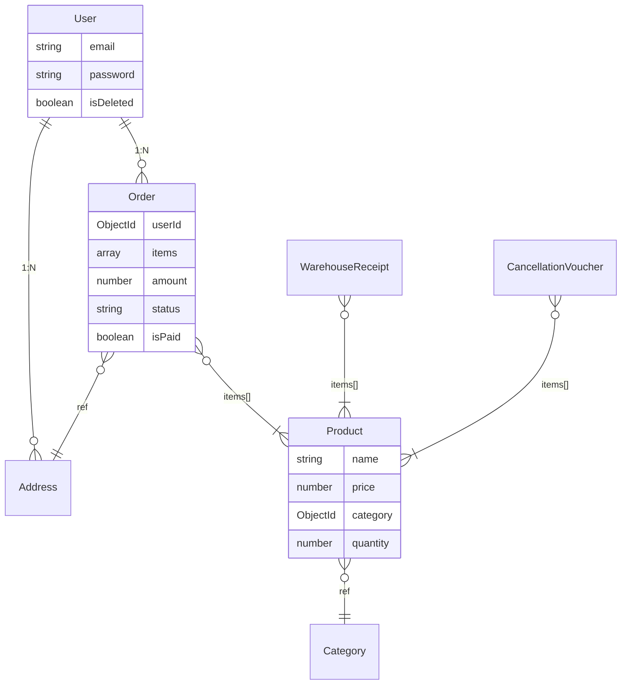

# 🛒 GreenCart - Nền tảng Thương mại Điện tử Fullstack (MERN)

<p align="center">
  
  
  
  
  
</p>

<p align="center">
  <a href="#-live-demo"><strong>Live Demo</strong></a> ·
  <a href="#-điểm-nhấn-kỹ-thuật-chính"><strong>Điểm nhấn Kỹ thuật</strong></a> ·
  <a href="#-kiến-trúc-hệ-thống--cơ-sở-dữ-liệu"><strong>Kiến trúc & CSDL</strong></a> ·
  <a href="#-hướng-dẫn-cài-đặt-(local)"><strong>Cài đặt</strong></a>
</p>

---

## 📖 Giới thiệu Dự án

**GreenCart** là ứng dụng thương mại điện tử fullstack được xây dựng theo kiến trúc RESTful API trên nền tảng **MERN Stack**. Dự án phân tách rõ ràng thành hai luồng trải nghiệm: **Khách hàng (Customer)** mua sắm trực tuyến, và **Trang quản trị (Admin/Seller Dashboard)** giúp quản lý sản phẩm, đơn hàng, kho bãi và theo dõi hiệu suất kinh doanh qua biểu đồ.

**Mục tiêu xây dựng:** Vận dụng các kiến thức thực tế về thiết kế hệ thống, quản lý state phức tạp trên SPA, và giải quyết các bài toán hóc búa của hệ thống thương mại điện tử như: tránh race condition khi cập nhật tồn kho, bảo mật xác thực (authentication) và xử lý dữ liệu lớn để làm báo cáo.

---

## 🚀 Điểm nhấn Kỹ thuật (Technical Highlights)

Đây là những giải pháp kỹ thuật cốt lõi giúp GreenCart trở thành một ứng dụng ổn định và sẵn sàng mở rộng:

- **Xử lý Đồng thời (Concurrency & Race Conditions):** Sử dụng hàm `bulkWrite` kết hợp toán tử Atomic (`$inc`) trong MongoDB để thực hiện trừ/trả tồn kho. Đảm bảo tính nhất quán dữ liệu (Data Integrity) và ngăn ngừa tình trạng bán vượt mức (Overselling) khi nhiều người dùng cùng thanh toán một lúc.
- **Tối ưu Tính toán Thống kê (Data Aggregation):** Áp dụng **MongoDB Aggregation Pipelines** phức tạp (`$match`, `$group`, `$project`, `$sort`) để phân tích doanh thu, lợi nhuận gộp theo chu kỳ (7 ngày, 12 tháng), lọc sản phẩm bán chạy/sắp hết hàng. Đẩy toàn bộ tác vụ tính toán nặng xuống Database thay vì xử lý trên Node.js Thread Pool.
- **Cơ chế Nhập/Hủy Kho Thực tế:** Xây dựng tính năng quản lý kho bài bản bằng **Phiếu Nhập (Warehouse Receipt)** và **Phiếu Hủy (Cancellation Voucher)**. Tồn kho biến động dựa trên các chứng từ này thay vì Admin tự sửa số. Hệ thống tính toán chính xác giá vốn trung bình và trừ hao phí tổn thất để ra báo cáo lợi nhuận thực tế.
- **Bảo mật & Xác thực Hai Phân Hệ:** Cấp phát phân quyền JWT độc lập giữa `User` và `Seller`. Token được đóng gói an toàn trong **HTTP-Only Cookies**, triệt tiêu nguy cơ bị tấn công XSS. Thiết lập Axios Interceptors toàn cục tại Client để bắt lỗi 401/403, tự động điều hướng và xóa state khi phiên hết hạn.
- **Tối ưu Trải nghiệm CSDL Address:** Sử dụng cấu trúc thông minh cho Sổ địa chỉ người dùng theo chuẩn sát nhập hành chính tại VN (chia cấp Tỉnh/Thành phố & Phường/Xã), bóc tách thành một bảng `Address` riêng biệt và dùng cơ chế `ref` trong Order thay vì nhúng tĩnh.

---

## 📸 Giao diện Trực quan

| Trải nghiệm Khách hàng (Customer Portal) | Trang Quản trị viên (Admin Dashboard) |
| :---: | :---: |
|  |  |

---

## ✨ Tính năng Nổi bật

### 🛍 Khách hàng (Customer Portal)
- Xác thực đăng nhập qua mật khẩu băm bằng **Bcrypt**, giỏ hàng tự động đồng bộ thời gian thực.
- **Sổ địa chỉ thông minh:** Quản lý nhiều địa chỉ giao hàng, tích hợp API Open API VN để chọn Tỉnh/Thành & Phường/Xã với logic sắp xếp chữ cái tiếng Việt.
- Cơ chế Giỏ hàng (Cart) linh hoạt, hỗ trợ cộng dồn, tự động tính thuế suất và quy đổi để thanh toán COD.
- Theo dõi tiến độ vận chuyển đơn hàng 5 trạng thái chuyên nghiệp (*Placed → Packing → Shipped → Out for Delivery → Delivered / Cancelled*).

### 🔧 Quản trị viên (Admin/Seller Dashboard)
- **Kiểm soát Sản phẩm & Danh mục:** CRUD với hình ảnh đẩy trực tiếp lên Cloud CDN (**Cloudinary**) thông qua Middleware **Multer**.
- **Quản trị Đơn hàng:** Đồng bộ trạng thái giao hàng, tự động hoàn trả số lượng (Refund Stock) cực kỳ an toàn nếu đơn chuyển sang trạng thái "Cancelled".
- **Biểu đồ thời gian thực:** Cung cấp biểu đồ trực quan (Recharts / Chart.js) trực tiếp từ API Aggregation.
- Quản lý tài khoản: Chức năng khóa người dùng (Soft-delete/Ban) cập nhật cưỡng chế ngắt kết nối User đang online.

---

## 🛠 Công nghệ Sử dụng

| Frontend (Client) | Backend (Server) | Database & Khác |
| ----------------- | ---------------- | --------------- |
| React 19 (Vite)   | Node.js ≥ 18     | MongoDB / Mongoose 9 |
| React Router v7   | Express.js 5     | Cloudinary (Image CDN) |
| Tailwind CSS 4    | JWT Auth         | Render / Vercel (CI/CD) |
| Axios / React Hot Toast | Bcryptjs / Mutler | GitHub Actions |

---

## 🏗 Kiến trúc Hệ thống & Cơ sở dữ liệu

**Mô hình Dữ liệu Chính:**


**Mô tả Luồng Thiết kế:**
1. **User ↔ Address**: Mỗi KH có nhiều địa chỉ. Order tham chiếu đến `Address` tĩnh, bảo toàn dữ liệu giao hàng kể cả khi User sửa/xóa địa chỉ gốc sau này.
2. **Product ↔ Inventory**: Không có thao tác `Nhập số lượng = 50` bằng tay, mọi thay đổi số lượng thực tế phải thông qua `WarehouseReceipt` (Nhập thêm) hoặc `CancellationVoucher` (Hủy đi do vỡ/hỏng). Rất sát thực tế vận hành Business.

---

## 🔌 API Endpoints (Docs Summary)

Back-end của dự án cung cấp các nhóm API chia nhỏ rõ rệt:

- **`/api/user/*`**: Luồng Client. Đăng ký, Đăng nhập, Check Auth, Lấy List Users (Cho Admin).
- **`/api/seller/*`**: Luồng Quản trị. Login, Check Phân quyền Admin.
- **`/api/product/*`** & **`/api/category/*`**: CRUD Catalog, Gọi lọc Sản phẩm (List, Bestseller).
- **`/api/order/*`**: Quản lý đặt hàng (COD), Đọc biến động doanh thu (Dashboard), Chuyển trạng thái đơn.
- **`/api/warehouse/*`** & **`/api/cancellation/*`**: Tạo và xem lịch sử chứng từ kho.

---

## 🚀 Hướng dẫn Cài đặt (Local)

**1. Clone dự án & Cài đặt môi trường**
```bash
git clone https://github.com/your-username/GreenCart.git
```

**2. Cài đặt Dependencies cho Server & Client**
```bash
cd GreenCart/server && npm install
cd ../client && npm install
```

**3. Khai báo Biến môi trường (`.env`)**

*Tại `server/.env`*
```env
PORT=8000
MONGODB_URI=mongodb+srv://<username>:<password>@cluster.xyz.mongodb.net
JWT_SECRET=your_secret_string
SELLER_EMAIL=admin@example.com
SELLER_PASSWORD=admin_password
CLOUDINARY_CLOUD_NAME=xxx
CLOUDINARY_API_KEY=xxx
CLOUDINARY_API_SECRET=xxx
```

*Tại `client/.env`*
```env
VITE_BACKEND_URL=http://localhost:8000
VITE_CURRENCY=₫
```

**4. Khởi chạy Ứng dụng**
Mở 2 Terminal riêng biệt:
```bash
# Terminal 1 - Backend (Cổng localhost:8000)
cd server && npm run dev

# Terminal 2 - Frontend (Cổng localhost:5173 / Vite)
cd client && npm run dev
```

---
*Dự án GreenCart được tối ưu hóa liên tục để thể hiện tư duy thiết kế phần mềm linh hoạt, an toàn và dễ bảo trì.*
