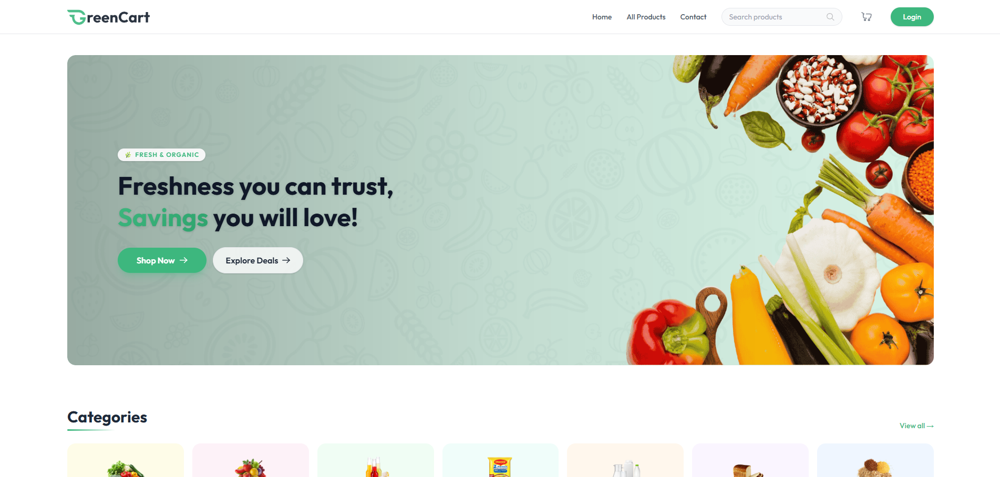
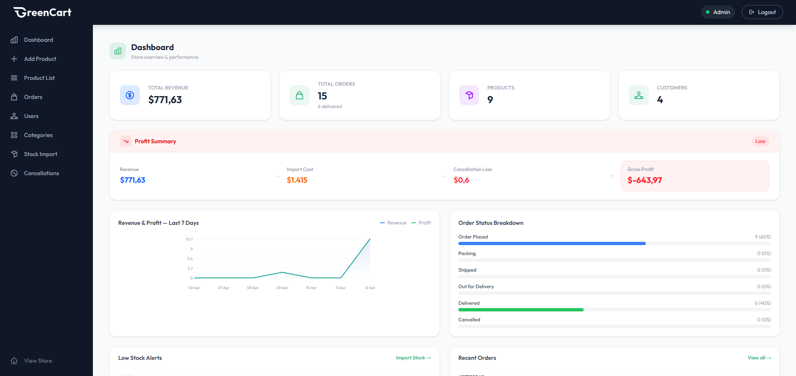
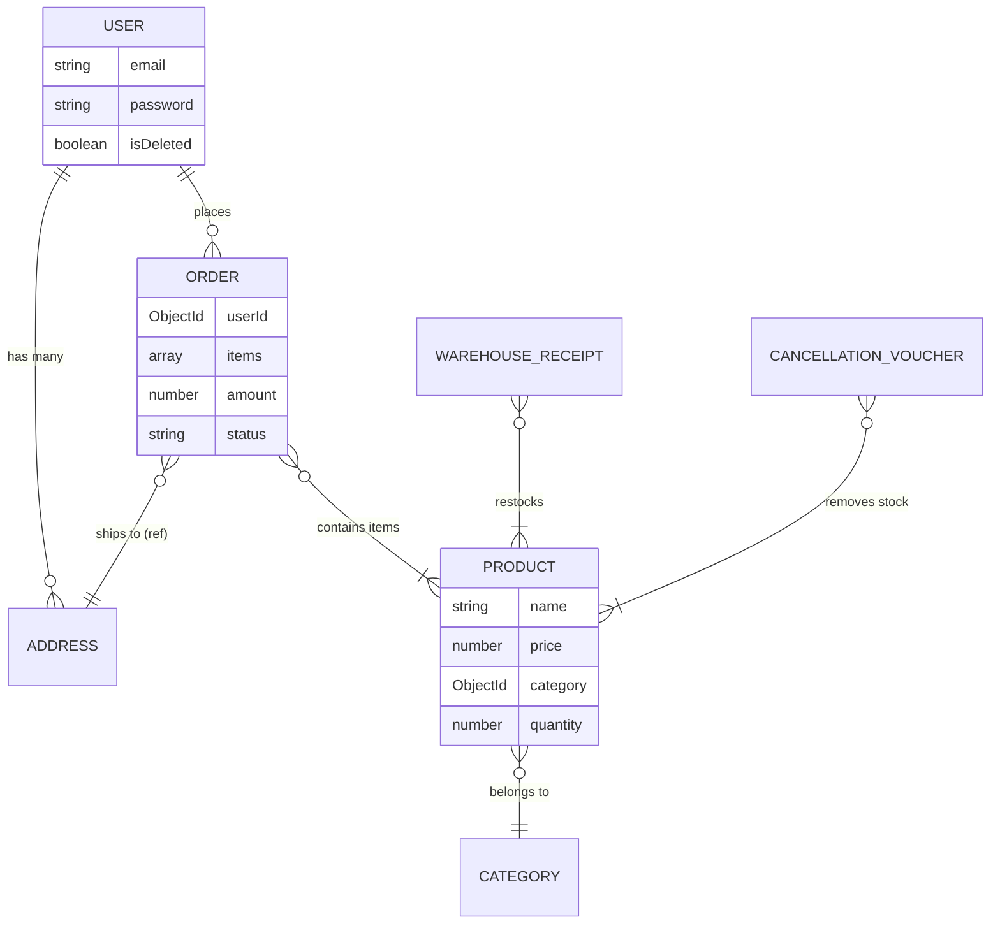

<div align="center">
  
  # 🛒 GreenCart - Full-stack E-Commerce Platform
  
  **A scalable, RESTful MERN stack application with strict inventory management and concurrent transaction handling.**
  
  <p align="center">
    
    
    
    
    
  </p>
  
  <!-- <a href="#-live-demo"><strong>Live Demo</strong></a> · -->
  <a href="#-technical-highlights--architecture"><strong>Architecture & Insights</strong></a> ·
  <a href="#-key-features"><strong>Features</strong></a> ·
  <a href="#-getting-started-local-setup"><strong>Setup</strong></a>
</div>

---

## 📖 Introduction

**GreenCart** is a modern e-commerce platform built to demonstrate advanced system design and full-stack development best practices. It features two distinct portals: a seamless **Customer Shopping Experience** and a robust **Admin/Seller Dashboard** for logistics, inventory, and sales analytics.

**Context:** Designed not just as a typical CRUD application, but as a system capable of handling real-world business challenges such as **race conditions** in checkout, **secure token policies**, and **complex database aggregations** for financial reporting.

---

## 🚀 System Architecture & Technical Highlights

This project tackles several complex backend and database design challenges:

### 1. Concurrency Control & Race Conditions Prevention

In a typical checkout scenario, multiple users might attempt to buy the last available item simultaneously.

- **Solution:** Utilized MongoDB's **Atomic Operators (`$inc`)** and `bulkWrite` operations during order placement. This ensures high data integrity and strictly prevents **overselling (negative inventory)**, offloading concurrency locks directly to the database layer.

### 2. Strict Inventory Management System

Rather than editing the "Stock Quantity" directly (which leads to data inconsistency over time), inventory mutations are strictly governed by **Documents**.

- **Implementation:** Real-world approach using **Warehouse Receipts** (Stock In) and **Cancellation Vouchers** (Stock Out / Damages / Expired). The system aggregates these documents to determine live inventory accurately.

### 3. Data Aggregations for Analytics

- Moved expensive runtime calculations from the Node.js event loop to **MongoDB Aggregation Pipelines**.
- Utilized multi-stage pipelines (`$match`, `$unwind`, `$group`, `$project`, `$sort`) to fetch 7-day revenue trends, daily profit margins, and dynamic best-seller filtering efficiently.

### 4. JWT Authentication Security

- Implemented dual-role architecture (`User` vs `Seller`).
- Tokens are stored solely in **HTTP-Only Cookies** to mitigate XSS (Cross-Site Scripting) attacks, while employing global Axios Interceptors on the frontend for automatic 401/403 forced session termination.

### 5. Smart Address Sourcing

- Instead of static strings, user shipping addresses are stored via references. Handled cascading address data dynamically. Ensures robust order state preservation even if user deletes their saved locations.

---

## 📸 UI / UX Showcase

|                   Customer Portal                   |           Admin / Seller Dashboard            |
| :-------------------------------------------------: | :-------------------------------------------: |
|  |  |

---

## ✨ Key Features

### 🛍️ Customer Portal

- **Authentication:** Secure registration & login via Bcrypt hashing.
- **Smart Checkout:** Synchronized shopping cart, real-time price & shipping fee calculation, supporting COD (Cash on Delivery) workflow.
- **Address Book Management:** Users can manage multiple shipping addresses via a normalized structural format (integrated with API for real-time validation).
- **Order Tracking:** 5-tier dynamic workflow (`Placed` → `Packing` → `Shipped` → `Out for Delivery` → `Delivered / Cancelled`).

### 🔧 Admin Dashboard

- **Catalog Management:** Full CRUD operations for Products and Categories. Image uploads are processed via **Multer** and directly streamed to **Cloudinary CDN**.
- **Order Fulfillment:** Sellers can update orders and trigger automatic **Stock Refunds** for "Cancelled" orders.
- **Sales Analytics:** Real-time visual charts powered by customized Backend APIs.
- **Account Moderation:** Dashboard to monitor user bases and apply soft-deletes/bans to malicious accounts.

---

## 🛠️ Technology Stack

| Frontend (Client)       | Backend (Server)    | Database & Infrastructure      |
| ----------------------- | ------------------- | ------------------------------ |
| **React 19** (Vite)     | **Node.js 18+**     | **MongoDB / Mongoose 9**       |
| **React Router v7**     | **Express.js 5**    | **Cloudinary** (Image CDN)     |
| **Tailwind CSS 4**      | **JWT** (HTTP-Only) | Render / Vercel (CI/CD)        |
| Axios, Hot Toast, Icons | Bcrypt.js, Multer   | RESTful API Design             |

---

## 🏗️ Entity Relationship Diagram



---

## 🔌 API Endpoints Summary

- **`/api/user/*`**: Client Auth, Profile settings, List users (Admin only).
- **`/api/seller/*`**: Admin Dashboard login & authorization middleware checks.
- **`/api/product/*`** | **`/api/category/*`**: Catalog browsing, filtering, CRUD.
- **`/api/order/*`**: Order placement, fulfillment lifecycle handling, and revenue data extraction.
- **`/api/warehouse/*`** | **`/api/cancellation/*`**: Inventory logic & document track record.

---

## 🚀 Getting Started (Local Setup)

### 1. Clone the repository

```bash
git clone https://github.com/your-username/GreenCart.git
cd GreenCart
```

### 2. Install Dependencies

You need to install packages for both frontend and backend subdirectories.

```bash
# Terminal 1 - Backend
cd server
npm install

# Terminal 2 - Frontend
cd client
npm install
```

### 3. Environment Variables Setup

Create `.env` files in both the `server` and `client` directories based on `.env.example`.

**`server/.env`**

```env
PORT=8000
MONGODB_URI=mongodb+srv://<username>:<password>@cluster.xyz.mongodb.net
JWT_SECRET=your_super_secret_string
SELLER_EMAIL=admin@example.com
SELLER_PASSWORD=admin_password
CLOUDINARY_CLOUD_NAME=xxx
CLOUDINARY_API_KEY=xxx
CLOUDINARY_API_SECRET=xxx
```

**`client/.env`**

```env
VITE_BACKEND_URL=http://localhost:8000
VITE_CURRENCY=$
```

### 4. Run the Application

Start the development servers for both environments concurrently.

```bash
# Terminal 1 - Backend
cd server
npm run server

# Terminal 2 - Frontend (Vite)
cd client
npm run dev
```

The client will be running at `http://localhost:5173` and the server at `http://localhost:8000`.

---

<div align="center">
  <i>Developed with ❤️. If you find this project helpful or inspiring, please give it a ⭐!</i>
</div>
