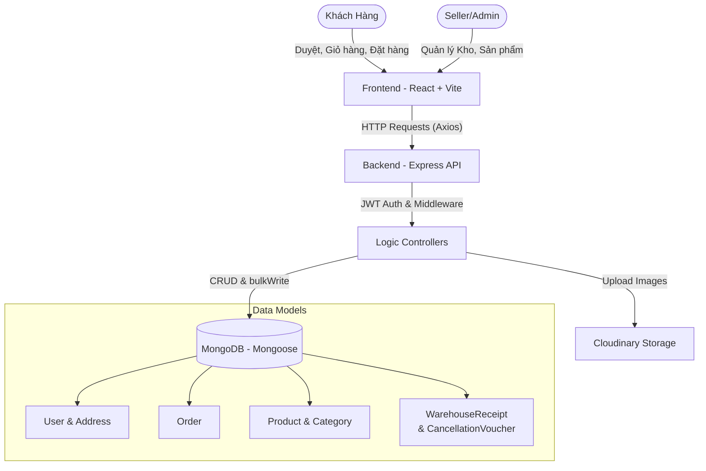

# 🛒 GreenCart

## **Nền tảng thương mại điện tử fullstack xây dựng trên MERN Stack**

## 📋 Mục lục

- [Giới thiệu dự án](#-giới-thiệu-dự-án)
- [Tính năng nổi bật](#-tính-năng-nổi-bật)
- [Công nghệ sử dụng](#-công-nghệ-sử-dụng)
- [Kiến trúc CSDL & Luồng hoạt động](#-kiến-trúc-csdl--luồng-hoạt-động)
- [Hướng dẫn cài đặt](#-hướng-dẫn-cài-đặt)
- [Biến môi trường](#-biến-môi-trường)
- [Hướng dẫn sử dụng](#-hướng-dẫn-sử-dụng)
- [Cấu trúc thư mục](#-cấu-trúc-thư-mục)

## 📖 Giới thiệu dự án

**GreenCart** là ứng dụng thương mại điện tử hiện đại, đầy đủ tính năng, được xây dựng trên nền tảng **MERN** (MongoDB, Express, React, Node.js). Dự án được cấu trúc thành hệ thống hai phần độc lập nhằm phục vụ cả trải nghiệm mua sắm mượt mà lẫn nghiệp vụ quản lý bán hàng chuyên sâu:

| Ứng dụng  | Mô tả                                                                | Cổng mặc định |
| --------- | -------------------------------------------------------------------- | ------------- |
| `client/` | Giao diện mua sắm cho khách hàng & Bảng điều khiển quản trị (Seller) | `:5173`       |
| `server/` | Máy chủ API RESTful xử lý logic                                      | `:4000`       |

---

## ✨ Tính năng nổi bật

### 🛍 Giao diện khách hàng (Customer Portal)

- **Quản lý tài khoản (Auth)**: Đăng nhập/Đăng ký với `JWT`. Phân quyền `authUser`.
- **Sổ địa chỉ (Addressbook)**: Thêm, sửa, xoá nhiều địa chỉ giao hàng cho cùng một tài khoản.
- **Trải nghiệm mua sắm**:
  - Duyệt sản phẩm và tìm kiếm theo danh mục.
  - Hiển thị danh sách sản phẩm mới, bán chạy (BestSeller).
  - Quản lý **Giỏ hàng trực tuyến**: Thêm/bớt số lượng, tự động tính tiền (`Subtotal`).
  - **Checkout chi tiết**: Hỗ trợ thanh toán (`Cash on Delivery`), tính tỷ lệ Thuế (Tax Rate 2%) trực tiếp từ server để đảm bảo an toàn.
- **Lịch sử đơn hàng**: Khách hàng theo dõi trạng thái (_Order Placed, Packing, Shipped, Out for Delivery, Delivered, Cancelled_).

### 🔧 Bảng quản trị & Kho hàng (Seller/Admin Dashboard)

- **Quốc gia/Phân quyền**: Truy cập đường dẫn `/seller` với xác thực `authSeller`.
- **Quản lý sản phẩm (Products)**: Thêm mới hình ảnh lên `Cloudinary`, thiết lập giá gốc và giá khuyến mãi (`offerPrice`).
- **Nghiệp vụ Kho Hàng chuyên sâu (Warehouse Receipts)**:
  - Tạo phiếu nhập kho (Restock) với mã phiếu tự động `IR-YYYYMMDD-XXX`.
  - Quản lý vốn nhập hàng (`unitCost`) và số lượng tăng trực tiếp vào `Product stock`.
- **Phiếu Hủy Sản Phẩm (Cancellation Voucher)**:
  - Khi hàng hoá bị lỗi hỏng (Damaged, Lost, Expired), tạo phiếu huỷ tự động cấp mã `CV-YYYYMMDD-XXX` để giảm tồn kho.
- **Quản lý Đơn Hàng (Orders)**:
  - Khấu trừ hoặc hoàn trả tự động số lượng trong kho khi trạng thái đơn thay đổi (đặc biệt khi Cancel).
- **Phân tích Dashboard toàn diện**:
  - Giao diện thống kê doanh số (`Gross Profit`), tổng vốn nhập hàng (`importCost`), và tổng tổn thất do huỷ sản phẩm (`cancellationLoss`).
  - Biểu đồ tăng trưởng 7 ngày gần nhất, thống kê sản phẩm sắp hết hạn/cạn kho (`quantity <= 5`).
- **Quản lý người dùng**: Tính năng hiển thị và `Toggle Delete` để khoá/mở khoá tài khoản khách hàng.

---

## 🛠 Công nghệ sử dụng

### Frontend (Client)

| Công nghệ           | Vai trò                         |
| ------------------- | ------------------------------- |
| **React 19**        | Thư viện UI xây dựng giao diện  |
| **Vite**            | Công cụ build tối ưu hóa tốc độ |
| **React Router v7** | Xử lý định tuyến SPA            |
| **Tailwind CSS 4**  | Framework CSS tiện ích          |
| **Axios**           | Giao tiếp với API               |
| **React Hot Toast** | Thông báo popup thân thiện      |
| **React Icons**     | Thư viện biểu tượng             |

### Backend (Server)

| Công nghệ                | Vai trò                          |
| ------------------------ | -------------------------------- |
| **Node.js**              | Môi trường chạy cho server       |
| **Express 5**            | Web Framework xây dựng API       |
| **MongoDB + Mongoose**   | Cơ sở dữ liệu và ODM             |
| **JWT & Bcryptjs**       | Xác thực và băm mật khẩu         |
| **Cloudinary & Multer**  | Lưu trữ và xử lý upload file ảnh |
| **CORS / Cookie-Parser** | Bảo mật và xử lý yêu cầu HTTP    |

---

## 🏗 Kiến trúc CSDL & Luồng hoạt động

Mongoose DB bao gồm các Collection chính kết nối chặt chẽ với nhau:

1. **User & Address**: Khách hàng `1` - `N` Địa chỉ giao hàng.
2. **Product & Category**: Sản phẩm `N` - `1` Category. Tồn kho (`quantity`) được quản lý bằng cơ chế **Atomic Update** (`bulkWrite` `$inc`).
3. **Order**: Snapshot chi tiết giỏ hàng và địa chỉ tại thời điểm đặt hàng. Lưu trữ mảng `items` gồm `product id` gắn kết `quantity`, tính toán tổng hóa đơn `amount`.
4. **WarehouseReceipt & CancellationVoucher**: Hoạt động song song giúp kế toán bán hàng:
   - `WarehouseReceipt`: Theo dõi lịch sử nhập hàng (`unitCost`) -> tăng kho.
   - `CancellationVoucher`: Huỷ sản phẩm lỗi (Damaged, Expired) -> trừ kho.

### Sơ đồ luồng hoạt động



---

## 🚀 Hướng dẫn cài đặt

### Yêu cầu hệ thống

- **Node.js** (Phiên bản >= 18.x)
- **MongoDB** (Local hoặc Atlas)
- **Cloudinary Account** (Cho upload ảnh)

### Các bước cài đặt

**1. Clone dự án**

```bash
git clone https://github.com/your-username/GreenCart.git
cd GreenCart
```

**2. Cài đặt thư viện**

```bash
# Server
cd server
npm install

# Client
cd ../client
npm install
```

**3. Thiết lập biến môi trường**
(Xem phần [Biến môi trường](#-biến-môi-trường) bên dưới)

**4. Chạy dự án**
Mở **2 Terminal** và chạy lệnh sau:

```bash
# Terminal 1 - Server
cd server
npm run server  # Chạy bằng nodemon

# Terminal 2 - Client
cd client
npm run dev
```

---

## 🔐 Biến môi trường

Tạo file `.env` ở thư mục `server/`:

```env
PORT=4000
MONGODB_URI=mongodb+srv://<username>:<password>@cluster.mongodb.net/<dbname>
JWT_SECRET=your_jwt_secret

# Cloudinary Config
CLOUDINARY_CLOUD_NAME=your_cloud_name
CLOUDINARY_API_KEY=your_api_key
CLOUDINARY_API_SECRET=your_api_secret

# Tài khoản admin mặc định
Email: admin@example.com
Password: 1
```

---

## 💻 Hướng dẫn sử dụng

| Ứng dụng              | Đường dẫn                      | Lưu ý                                   |
| --------------------- | ------------------------------ | --------------------------------------- |
| **Khách hàng**        | `http://localhost:5173`        | Trải nghiệm mua sắm                     |
| **Quản trị / Seller** | `http://localhost:5173/seller` | Sử dụng tài khoản có quyền Seller/Admin |
| **API Server**        | `http://localhost:4000`        | Endpoints backend                       |

---

## 📂 Cấu trúc thư mục cốt lõi

```text
GreenCart/
│
├── client/                      # Giao diện người dùng và Seller
│   ├── src/
│   │   ├── components/          # Reusable components (Navbar, Sidebar, vv.)
│   │   ├── pages/               # Customer pages (Home, Cart, Product, MyOrders, vv.)
│   │   │   └── seller/          # Bảng điều khiển nghiệp vụ (Dashboard, Warehouse, Cancellation)
│   │   ├── context/             # AppContext (Quản lý giỏ hàng, xác thực)
│   │   └── App.jsx
│   ├── package.json
│   └── vite.config.js
│
├── server/                      # Máy chủ REST API
│   ├── controllers/             # Logic (user, product, order, warehouse, cancellation, vv.)
│   ├── middlewares/             # JWT Auth, Upload (authUser, authSeller, multer)
│   ├── models/                  # Mongoose Schemas (User, Address, Category, Product, Order, WarehouseReceipt, CancellationVoucher)
│   ├── routes/                  # API endpoints
│   ├── config/                  # DB, Cloudinary connection
│   ├── server.js                # App entry point
│   └── package.json
│
└── README.md                    # Tài liệu dự án
```
